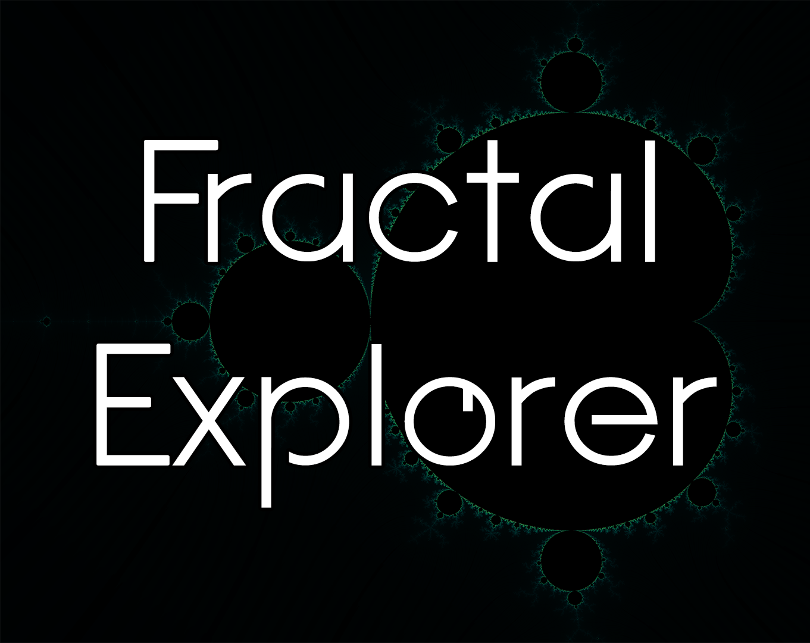
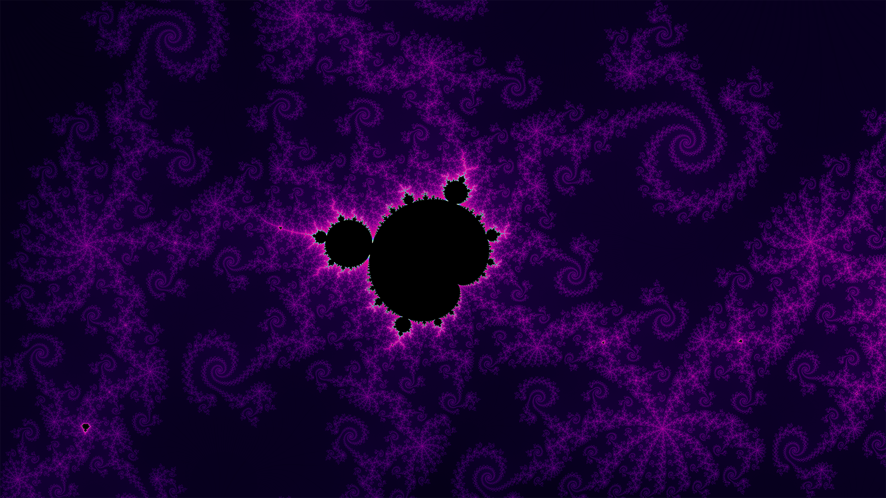
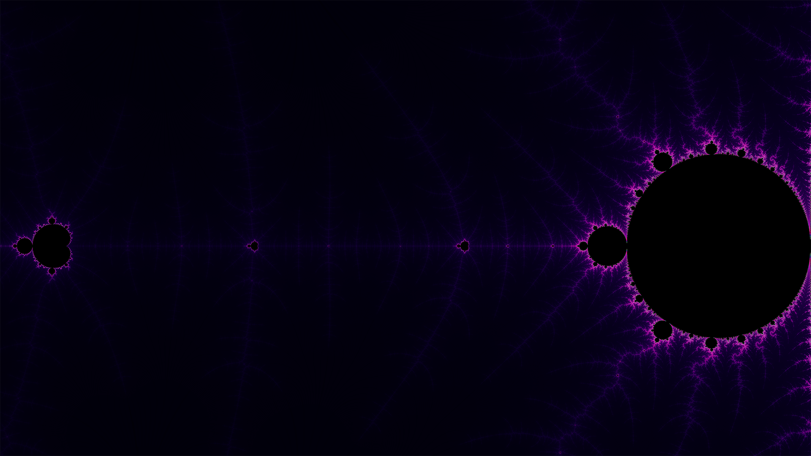
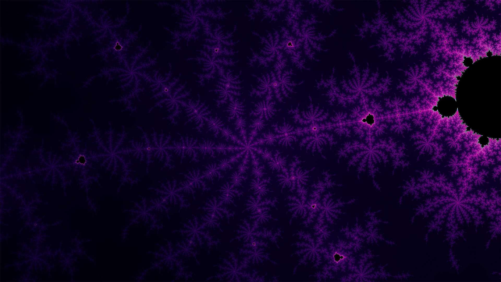
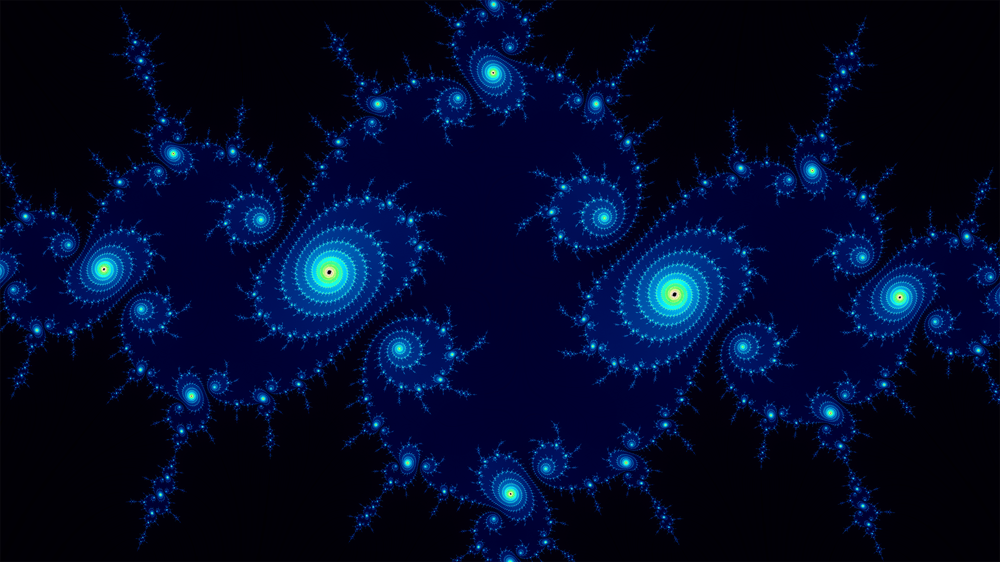
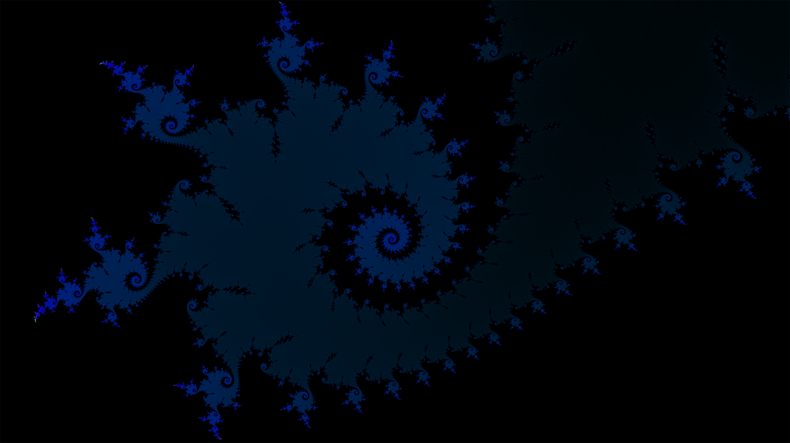
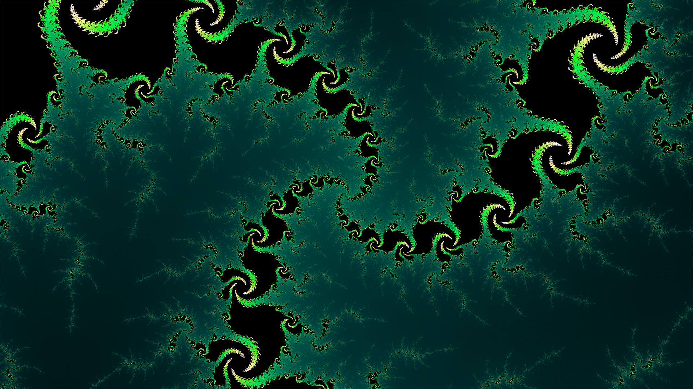

## Description

In this web application, you can freely explore the mandelbrot fractal and its julia sets! But don't zoom in too much ;)  
When you find a cool place, just click the export button and the app will automatically save it as an 8K resolution picture.

[Try it on my itch.io page!](https://vynokris.itch.io/fractal-explorer)

 

## Technical information

This project is coded in C++, using Raylib to render fractals with shaders.  
The user interface is done using ImGui and its bindings for raylib: [rlImGui](https://github.com/JeffM2501/raylibExtras/tree/index/rlImGui).  
To export images, I am currently using stbi, but this will change since this library uses way too much memory to export large files.

 

## What I'm currently working on:

Finding a way to zoom further.  
Exporting higher resolution images.  
Adding more fractals.  
Computing buddha sets.

 

## Screenshots

 
 
 

